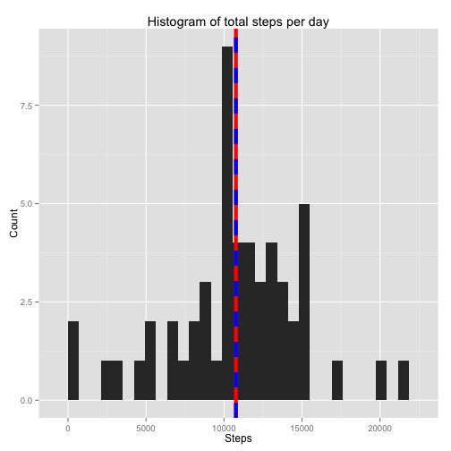
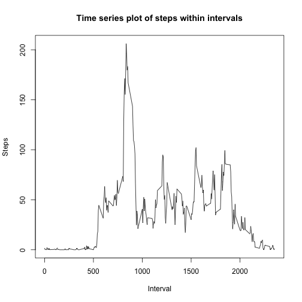
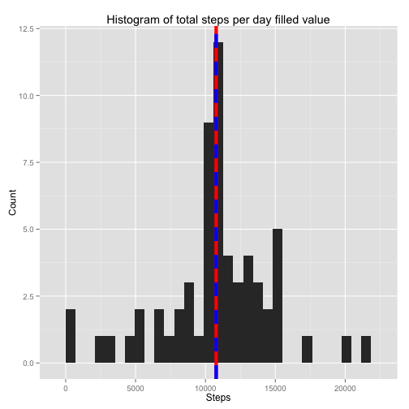
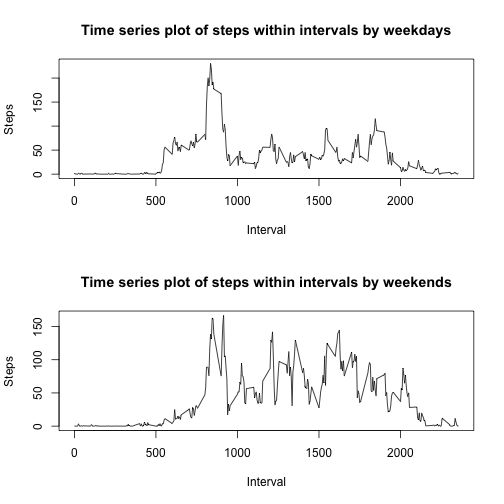

    This is a report of data from a personal activity monitoring device.

##Step 0: Import required packages

```r
library("ggplot2")
```

##Step 1: Loading and preprocessing the data


```r
#Load data
data = read.csv("activity.csv")
str(data)
```

```
## 'data.frame':	17568 obs. of  3 variables:
##  $ steps   : int  NA NA NA NA NA NA NA NA NA NA ...
##  $ date    : Factor w/ 61 levels "2012-10-01","2012-10-02",..: 1 1 1 1 1 1 1 1 1 1 ...
##  $ interval: int  0 5 10 15 20 25 30 35 40 45 ...
```

```r
#Elimate NA terms and store as a new vector
data_na = data[rowSums(is.na(data))==0,]
```

<br><br>
##Step 2: Calculate the mean total number of steps taken per day


```r
par(mfrow=c(1,1))
#Calculate the total number of steps taken per day
step_per = tapply(data_na$steps,data_na$date,sum)
#Elimate the NA terms and convert data into data frame
step_per_na = step_per[is.na(step_per)==0]
step_per_frame = data.frame(names(step_per_na),step_per_na)
colnames(step_per_frame) = c("Date","Steps")
#Calculate mean and median of total steps per day
mean_per = mean(step_per_frame$Steps)
mean_per
```

```
## [1] 10766.19
```

```r
median_per = median(step_per_frame$Steps)
median_per
```

```
## [1] 10765
```

```r
#Plot histogram,red line is mean and dashed blue line is median.

ggplot(step_per_frame,aes(step_per_frame$Steps))+geom_histogram()+ggtitle("Histogram of total steps per day")+ylab("Count")+xlab("Steps")+geom_vline(xintercept = mean_per,col="red",size=2)+geom_vline(xintercept=median_per,col="blue",linetype="dashed",size=2)
```

```
## stat_bin: binwidth defaulted to range/30. Use 'binwidth = x' to adjust this.
```

 

As shown from the above graph, the mean of total steps per day is 10766.19, and median is 10765.

<br><br>
##Step 3: The average daily activity pattern

 

```
##      835 
## 206.1698
```

As shown before, 835-840 interval, on average across all the days in the dataset, contains the maximum number of steps.

<br><br>
##Step 4: Imputing missing values


```r
#Calculate the total number of missing values in dataset
na_num = nrow(data) - nrow(data_na)
na_num
```

```
## [1] 2304
```

```r
#Use the mean for 5 minutes interval to fill in NA and create a new dataset
step_int_full = rep(step_int,nrow(data)/length(step_int))
data_fill = data
data_fill[rowSums(is.na(data))!=0,1] = step_int_full[rowSums(is.na(data))!=0]
#Make a histogram of the total number of steps taken each day and Calculate and report the mean and median total number of steps taken per day.
step_new_per = tapply(data_fill$steps,data_fill$date,sum)
step_new_frame = data.frame(names(step_new_per),step_new_per)
colnames(step_new_frame) = c("Date","Steps")
mean_new = mean(step_new_frame$Steps)
mean_new
```

```
## [1] 10766.19
```

```r
median_new = median(step_new_frame$Steps)
median_new
```

```
## [1] 10766.19
```

```r
ggplot(step_new_frame,aes(step_new_frame$Steps))+geom_histogram()+ggtitle("Histogram of total steps per day filled value")+ylab("Count")+xlab("Steps")+geom_vline(xintercept = mean_per,col="red",size=2)+geom_vline(xintercept=median_per,col="blue",linetype="dashed",size=2)
```

```
## stat_bin: binwidth defaulted to range/30. Use 'binwidth = x' to adjust this.
```

 

The mean of the filled data is the same as the mean from question 1. And the median of the new data is simllar to the previous one which has 0.19 difference. The impact is after filling average, median will approach to mean.

<br><br>
##Step 5:Differences in activity patterns between weekdays and weekends


```r
#Create a new factor variable in the dataset with two levels – “weekday” and “weekend”
weeks = weekdays(as.Date(data_fill$date))
weekday = which(weeks != "Sunday" & weeks != "Saturday")
weekend = which(weeks == "Sunday" | weeks == "Saturday")
weeks[weekday] = "weekday"
weeks[weekend] = "weekend"
data_fill[,4] = as.factor(weeks)
colnames(data_fill) = c("steps","date","interval","week")
#Make a panel plot containing a time series plot of the 5-minute interval
split_frame = split(data_fill,data_fill$week)
par(mfrow=c(2,1))
#Week days
step_week = tapply(split_frame[[1]]$steps,as.factor(split_frame[[1]]$interval),mean)
plot(names(step_week),step_week,type="l",xlab="Interval",ylab="Steps",main="Time series plot of steps within intervals by weekdays")
#Weekend days
step_weken = tapply(split_frame[[2]]$steps,as.factor(split_frame[[2]]$interval),mean)
plot(names(step_weken),step_weken,type="l",xlab="Interval",ylab="Steps",main="Time series plot of steps within intervals by weekends")
```

 

Shown from the graph, during weekends the average performace is better than the one during the weekdays. The activity pattern in weekends is more frequently than weekdays.
